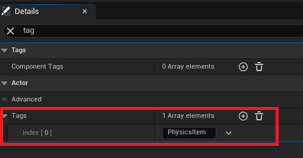
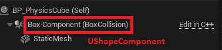
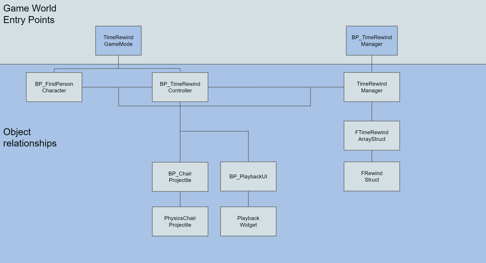
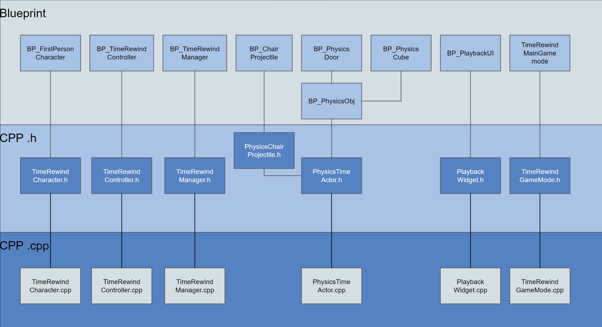
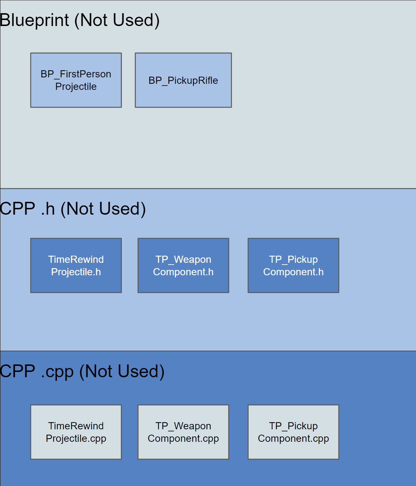

# Time Rewind Demo

## What

A small C++ demo in UE5 that allows for time rewind, replay and alteration of physics objects. It records up to 30 seconds (configurable, not hard-coded) of time and allows the player to open a timeline and playback the events.

When unpausing, the physics will reset back to the state at that point in time in the timeline, allowing the player to change events as they happened.

Player can switch cameras and watch event playback from different camera views.

[https://www.youtube.com/watch?v=aox8kwKOQo0](https://www.youtube.com/watch?v=aox8kwKOQo0)

## License

My parts are licensed under the MIT license and anyone is free to use it as a base for any other software, including commercial, as long as I am credited. 

Unreal Engine and any default code is licensed under Epic’s software usage license.

See the LICENSE.txt file

## Documentation

#### Tagging objects

The core of the system is that certain objects in the world using physics have a tag called **PhysicsItem**. It’s important that each of these actors has a high level collision component (**UShapeComponent**) that is handling the physics. These will be the only objects tracked for the time rewind timeline. 

#### Entry points and relationships

## Limitations

#### **Tagged Objects**

I only record objects with the **PhysicsItem** tag. This is for optimization as most things don’t move or need recording. 

I do not record the player movement, but it certainly could be done.

#### **30 seconds**

It currently only records 30 seconds of time. This is configurable but it is currently all stored in memory. If you wanted a game mechanic where someone could rewind a few seconds and alter events, then this should be fine.

If you want a full video playback, it would probably need to write to a file and allow reading from file. Then you could record large amounts of data.

The amount of data recorded is small, so you could probably store quite a lot of physics objects and time, but I have only tested out to 30 seconds. 

#### **Performance**

I did not do much optimization so it may need work if you want to scale to large numbers of physics objects.

Currently I’m only recording events every 60 ms. This means there is a window where some very fast things could be missed. It’s unlikely a player would notice at 60ms since that is about as fast as they could blink.

If you have large numbers of physics objects, then you may need to slow down the recording rate in case it starts losing framerate from processing each physics object. There may be a data-oriented way to speed up recording by re-using the same instructions..

## Questions

#### **Why 30 seconds?**

Pretty arbitrary really. Seemed like a reasonable amount of gameplay to record for playback.

#### **Why not use event dispatchers?**

No reason in particular. This could be an optimization if the number of objects gets very large. I just have everything managed by my TimeRewindManager and a loop of the objects in the scene. This works great for simplicity, but depending on your needs you may need to update the manager to record events differently.

#### **Why block player movement during playback?**

For my purposes, I wanted it to be more of a video playback as opposed to a game mechanic. If you want it to be more of a freeze/unfreeze mechanic in game, you could easily remove the isBlocked functionality inside of TimeRewindCharacter.cpp. 

#### **Why record with a timer instead of event tick?**

Event tick runs every frame and can be quite expensive. Instead of adding custom logic instead of event tick to check for if we have exceeded my 60ms recording time, I just let a timer do it. The timers are managed by Unreal and would do the same. 

#### **Why spawn all projectiles at game start instead of at time of event?**

This is a minor optimization for memory and speed. I set a max number of projectiles and spawn them off screen so that they are always available. This means new objects do not need to be spawned and put into memory at event time. If you needed different projectiles or an entirely different interaction, it may make sense to spawn only at event time and append to the time rewind system. I haven't tested this thoroughly to see what happens if you spawn a bunch of objects midgame so there could be some interesting limitations I do not know about. In my limited testing, it seemed to work fine to add objects to the timeline.

#### **How do I dynamically add a new physics object to track for the timeline?**

You want to call **AppendPhysicsObjects** in **TimeRewindManager.cpp** either through C++ or Blueprint. You'll have to pass in the collision component from the actor, not the actor itself.

#### **How do I change the max number of projectiles?**

The variable is **numProjectiles** in **TimeRewindController.h**

#### **How do I change the off screen default spawn position of the projectiles?**

The variable is **projectileSpawnPosition** in **TimeRewindController.h**

#### **How do I change how often it records an event?**

If you want to record more or less often than 60ms, it is the **TimeDelay** variable inside of **TimeRewindManager.h**. 

#### **How do I change how much time it records?**

If you want to change how much time is recorded, it is the **TimeRecorded** variable inside of **TimeRewindManager.h**. 

